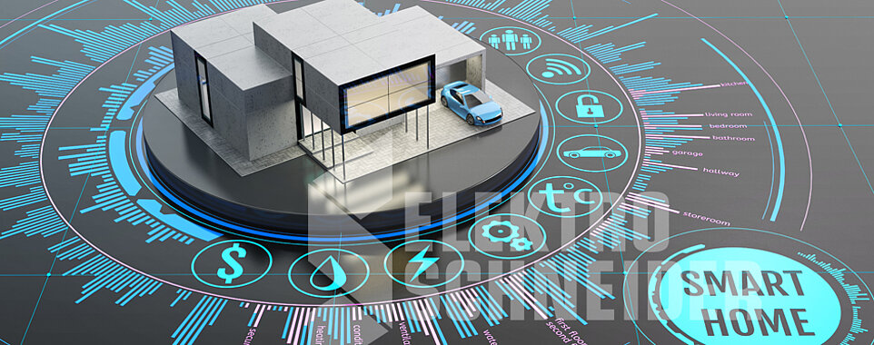

# Smart Home Security System

## Overview
In today's world, ensuring the safety of your home has never been more critical. With rising burglary rates, it's essential to have a reliable security system. Homeowners face various challenges, including break-ins, package thefts, and false alarms. A robust home security system must comprehensively address these issues.

## Project Contents

### Monitoring
- **Temperature & Gas Leakage Monitoring:** Utilize LM35 and MQ2 sensors to monitor temperature and detect gas leaks.
- **Unauthorized Access Detection:** Implement a login system using a keypad and LCD display.
- **Forceful Window Opening Detection:** Employ tilt and vibration sensors to detect if windows are opened forcefully.
- **Suspicious Motion Detection (Package Thefts):** Use PIR (Passive Infrared) and vibration sensors to detect suspicious motion outside.

### Alarm and Display
- **Alarm Triggering:** Set up an alarm system with LED indicators.
- **System Status Display:** Show system status and events on an LCD screen.

### Event Logging
- **EEPROM Logging:** Log all events in EEPROM memory for later review.
- **USART Communication:** Use USART protocol with a virtual terminal to display EEPROM contents.

## Project demo

https://github.com/user-attachments/assets/5d909e3e-a4c7-4fd7-84c4-1da00d52c9ee

